<div align="center">
  
  
  

# Nikita Lukyanov

`[ PYTHON BACKEND ENGINEER ]`

<p>
  <a href="https://career.habr.com/unw4rd3n"></a>
  <a href="https://t.me/infoiseasy"></a>
  <a href="mailto:nickfgh@mail.ru"></a>
</p>
</div>

```text
+---------------------------------------------------------------+
| VALUE: Building high-load Python backends with fast SQL and   |
|        resilient event pipelines for production systems.      |
+---------------------------------------------------------------+
```

```text
+---------------------------------------------------------------+
|                NK-LABS TERMINAL :: BOOT SEQUENCE             |
+---------------------------------------------------------------+
| [ OK ] kernel................. linux-container-ready          |
| [ OK ] network................ api-gateway-online             |
| [ OK ] storage................ postgresql-connected           |
| [ OK ] cache.................. redis-connected                |
| [ OK ] stream................. kafka-channel-online           |
| [ OK ] tests.................. pytest-suite-passed            |
| [ OK ] user................... nikita_lukyanov               |
+---------------------------------------------------------------+
```

```bash
$ stack --visible
Python | FastAPI | PostgreSQL | Redis | Kafka | Docker | Linux | CI/CD | Pytest

$ geo
Saint Petersburg, Russia

$ english
Level B
```

## TERMINAL_PROFILE

```text
[+] Commercial backend experience: 2+ years
[+] Domain: cybersecurity and high-load backend services
[+] Focus: resilient API architecture + SQL performance
[+] Strength: turning complex backend tasks into stable production systems
```

## CORE_STACK

| Layer | Tools |
|---|---|
| API | Python, FastAPI, REST |
| Data | PostgreSQL, Redis, SQL tuning |
| Infra | Docker, Linux, CI/CD |
| Quality | Pytest, Git, OOP, Algorithms |

## SELECTED_PROJECTS

| | |
|---|---|
| <a href="https://github.com/Unw4rd3n/sql-performance-lab"></a> | <a href="https://github.com/Unw4rd3n/Anti-Fraud-Event-Platform"></a> |
| <a href="https://github.com/Unw4rd3n/pi-gateway-auth-service-clean"></a> | <a href="https://github.com/Unw4rd3n/GoFlow"></a> |

## LIVE_ACTIVITY


## CONTRIBUTION_SNAKE


## EXPERIENCE

### BI.ZONE - Backend Developer (Middle)

`2023-08 -> 2025-09`

- Backend development for cybersecurity platform components.
- PostgreSQL schema design and query optimization under load.
- Service-to-service REST integrations.
- Test coverage growth to `80%+` and targeted critical bug fixes.

## EDUCATION

- Baltic State Technical University `VOENMEH` (Information and Control Systems, AI) - `2024 -> now`

## CONTACT

- Telegram: [@infoiseasy](https://t.me/infoiseasy)
- Habr Career: [career.habr.com/unw4rd3n](https://career.habr.com/unw4rd3n)
- Email: [nickfgh@mail.ru](mailto:nickfgh@mail.ru)
